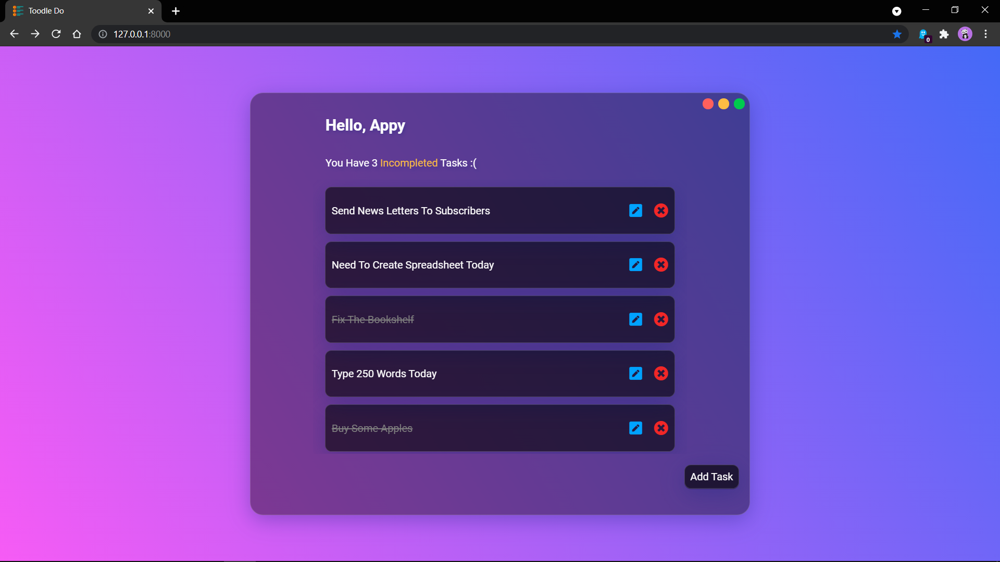

# Toodle Do

This responsive Todo webapp is created using Django framework.

It is a simple Todo list app, which keeps track of all the Tasks.

It's UI is inspired by the modern **Glassmorphism Design** which
is a minimalistic semi-transparent design which uses the **backdrop-filter property**
to obtain the glassy design.

Some Samples :rocket:





# Installation

1. Clone the respository: ``` git clone https://github.com/ArpitSandal/Django-Todo.git ```

2. Install django and make sure you have python installed: ``` pip install django ```

3. cd into the todo folder and type : ``` python manage.py runserver ```

4. View in browser at: ``` http://127.0.0.1:8000/ ```


### Happy Todo-ing :smiley: