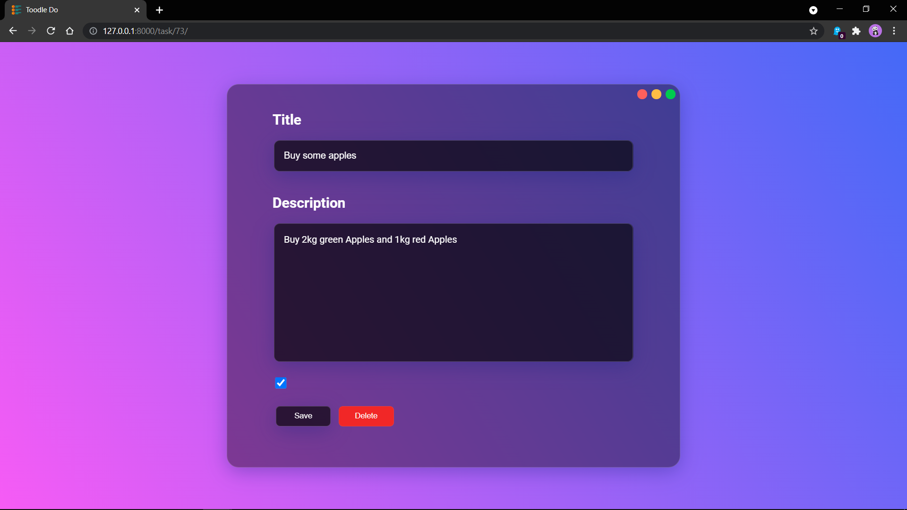

# Toodle Do

A Simple Todo list app written in Django and Python.

It's UI is inspired by the modern **Glassmorphism Design**,
which looks Minimalistic and Glassy :)

Here Are Some Samples :rocket:





# Installation

1. Clone the respository: ``` git clone https://github.com/ArpitSandal/Todo-list-Django.git```

2. Install django and make sure you have python installed: ``` pip install django ```

3. cd into the todo folder and type : ``` python manage.py runserver ```

4. View in browser at: ``` http://127.0.0.1:8000/ ```

